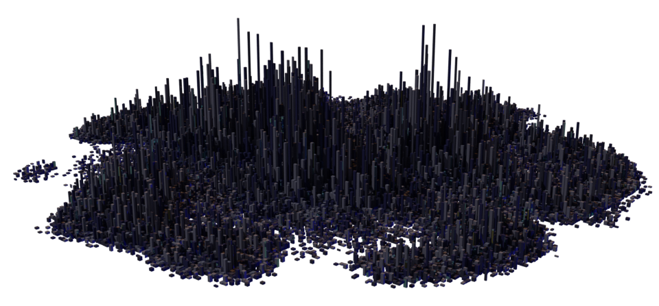

# City Generator

A geometry-nodes-based city generator for Blender 4.2.1 LTS! It'll probably also work in later versions, but I haven't tested so I can't be sure

## How to use

- Ensure you have Blender 4.2.1 LTS or later installed - if you don't, you can install it the lates version of Blender [here](https://www.blender.org/download/)
- Download the latest City Generator Blender file from the [releases page](https://github.com/AxiDragon/city-generator/releases) and open it
- In the bottom-left, you can modify the values to change the appearance of the city

- If you want to change the appearance of the materials, you can modify them in the materials tab

- If you want to use the city generator in another Blender file, in the other Blender file, press File > Append in the top left.

- Navigate to the City Generator Blender file, open it, and select the City object in the Object folder, and click Append.

## Examples

## Known Issues

- Setting BuildingHeight to a low value (less than 1) makes the city sprawl to the edges of the grid, resulting in an unnatural look
